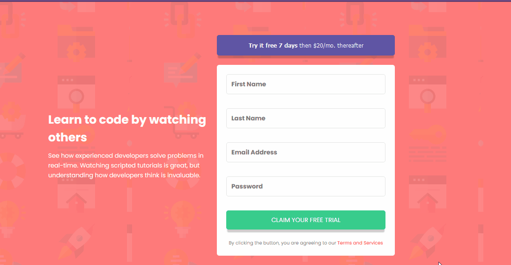

# Frontend Mentor - Intro component with sign up form solution

Esta é uma solução para [Intro component with sign up form challenge on Frontend Mentor](https://www.frontendmentor.io/challenges/intro-component-with-signup-form-5cf91bd49edda32581d28fd1).

## Index

- [Overview](#overview)
  - [O Desafio](#o-desafio)
  - [Screenshot](#screenshot)
  - [Links](#links)
- [Meu processo](#meu-processo)
  - [Feito com](#feito-com)
  - [O que aprendi](#o-que-aprendi)
  - [Recursos úteis](#recursos-úteis)
- [Autor](#autor)

## Overview

### O Desafio

Usuários devem ser capazes de :

- Ver o layout responsivo em diferentes tamanhos de tela
- Ver todos os estados ativos
- Mostrar uma mensagem de erro quando o formulário for enviado:
  - Se qualquer input for vazio exibir a mensagem. _"[Field Name] cannot be empty"_
  - Se o email não estiver formatado corretamento como email exibir a mensagem _"Looks like this is not an email"_

### Screenshot

### Links

- Solution URL: [Add solution URL here](https://your-solution-url.com)
- Live Site URL: [Add live site URL here](https://your-live-site-url.com)

## Meu processo

### Feito com

- Semantic HTML5 markup
- CSS Grid
- Mobile-first workflow
- [React](https://reactjs.org/) - Biblioteca JS
- [React hook form](https://react-hook-form.com/) -Biblioteca React para lidar com formulários
- [Yup](https://github.com/jquense/yup) - Biblioteca para auxiliar na validação dos campos do form.

### O que aprendi

O desafio agora foi aprender a validar o formulário utilizando bibliotecas e não fazendo tudo do zero. Embora o uso de bibliotecas facilite alguns processos, pesquisar e aprender a utilizar uma biblioteca é um bom aprendizado.
Nesse caso aprender a utilizar o react hook form para facilitar o envio de dados do formulário e o Yup para validar os mesmos.

### Recursos úteis

- [Validação com o yup](https://react-hook-form.com/get-started#SchemaValidation) - A documentação é incrível e foi o suficiente para fazer o projeto.

## Autor

- Website - [Gabriel Mascarenhas](https://rialbeg.github.io/portfolio/)
- Frontend Mentor - [@rialbeg](https://www.frontendmentor.io/profile/rialbeg)
- Linkedin - [@gsamascarenhas](https://www.linkedin.com/in/gsamascarenhas/)
